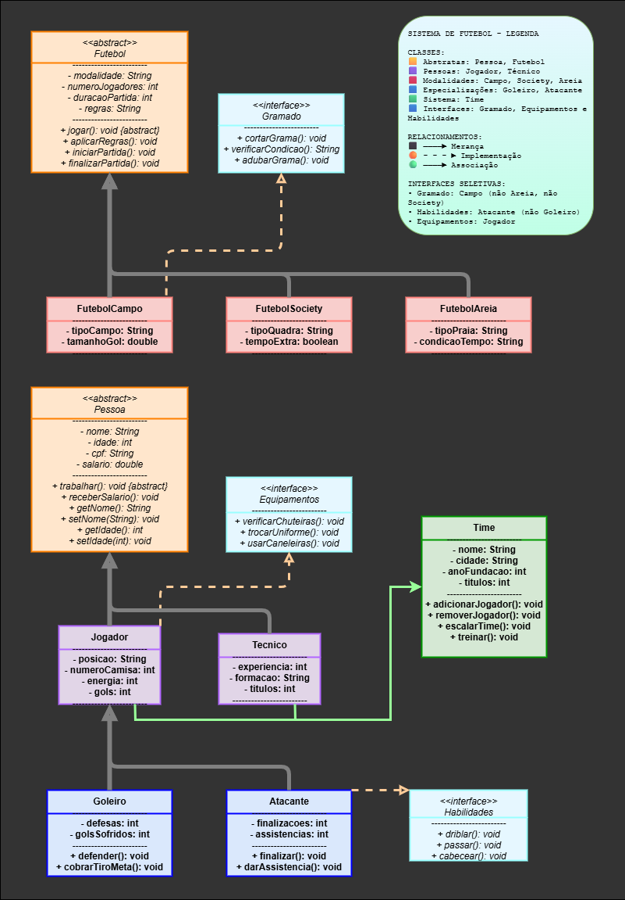

# Diagrama e Relações de Classes - Gerenciamento de Futebol

Este projeto modela entidades relacionadas a um sistema de gerenciamento de futebol, utilizando conceitos de orientação a objetos (Java). Abaixo, descrevo as principais classes, interfaces e suas relações.

## Classes Principais

- **Pessoa (É superclass de Jogador e Tecnico)**
  - Representa uma pessoa genérica (nome, idade, cpf, salário, etc)
- **Jogador (extends Pessoa, implements Equipamentos)**
  - Representa um jogador de futebol (posição, número da camisa, energia, gols)
  - Métodos de Equipamentos: verificarChuteiras, trocarUniforme, usarCaneleiras
- **Goleiro (extends Jogador)**
  - Especialização de Jogador (defesas, gols sofridos)
  - Métodos específicos: defender(), cobrarTiroDeGol()
- **Atacante (extends Jogador, implements Habilidades)**
  - Especialização de Jogador (finalizações, assistências)
  - Métodos específicos: finalizar(), darAssistencia(), driblar(), passar(), cabecear()
- **Tecnico (não apareceu, mas referenciado na Main e Time)**
  - Representa o técnico do time
- **Time**
  - Representa um time de futebol (nome, cidade, ano de fundação, títulos)
  - Possui lista de jogadores e um técnico
  - Métodos para adicionar/remover jogadores, escalar time, treinar
- **Futebol (abstract)**
  - Superclasse para modalidades de futebol (modalidade, número de jogadores, duração da partida)
  - Método abstrato iniciarJogo()
- **FutebolCampo, FutebolSociety, FutebolAreia (extends Futebol)**
  - Especializações para diferentes tipos de futebol (campo, society, areia), cada uma com atributos próprios
- **Gramado (interface)**
  - Métodos: cortarGrama(), verificarCondicao(), adubarGramado()

## Interfaces

- **Equipamentos**
  - Implementada por Jogador
- **Habilidades**
  - Implementada por Atacante

## Diagrama Visual

Abaixo está um diagrama de exemplo:



## Relações Explicadas

- **Herança**:
  - Jogador herda Pessoa, Goleiro e Atacante herdam Jogador.
  - Futebol é classe abstrata para FutebolCampo, FutebolSociety, FutebolAreia.
- **Composição**:
  - Time possui uma lista de Jogadores e um Técnico.
- **Implementação de Interfaces**:
  - Jogador implementa Equipamentos (funções relacionadas a equipamentos esportivos).
  - Atacante implementa Habilidades (funções como driblar, passar, cabecear).
  - FutebolCampo implementa Gramado (funções relacionadas ao gramado).


Abaixo está um diagrama:

```
    Pessoa <|-- Jogador
    Jogador <|-- Goleiro
    Jogador <|-- Atacante
    Jogador <|.. Equipamentos
    Atacante <|.. Habilidades
    Time -- Jogador
    Time -- Tecnico
    Futebol <|-- FutebolCampo
    Futebol <|-- FutebolSociety
    Futebol <|-- FutebolAreia
    FutebolCampo ..|> Gramado
```


